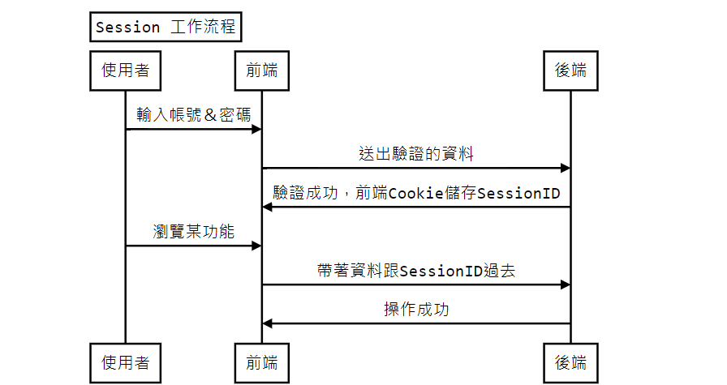
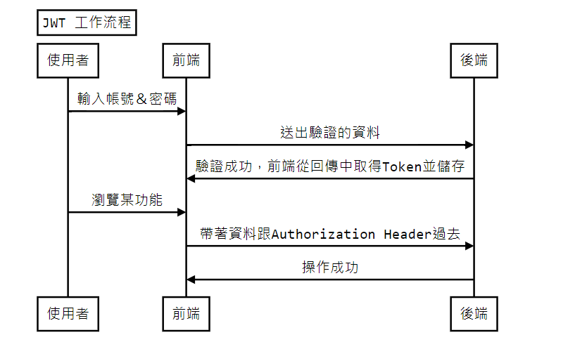
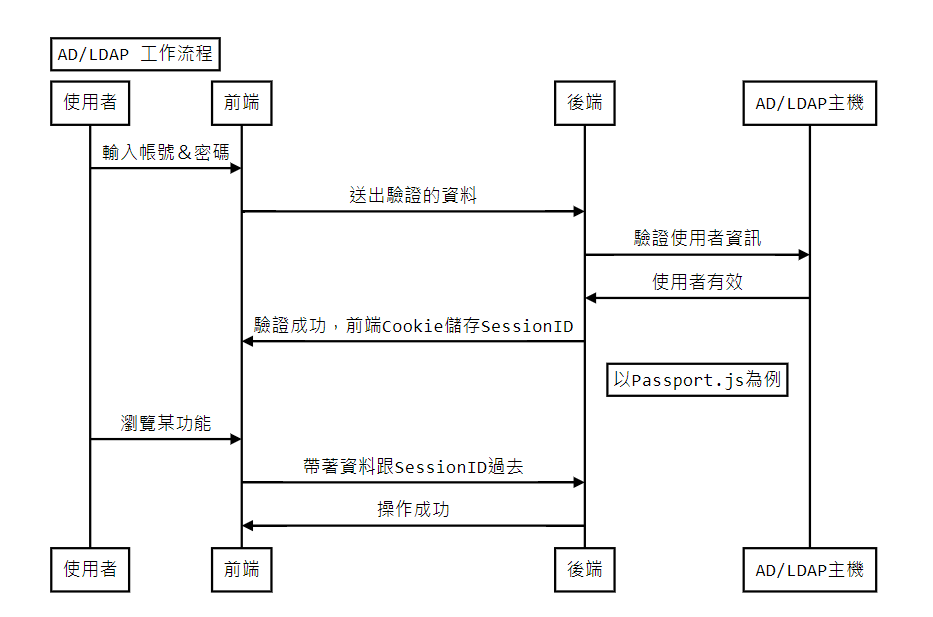
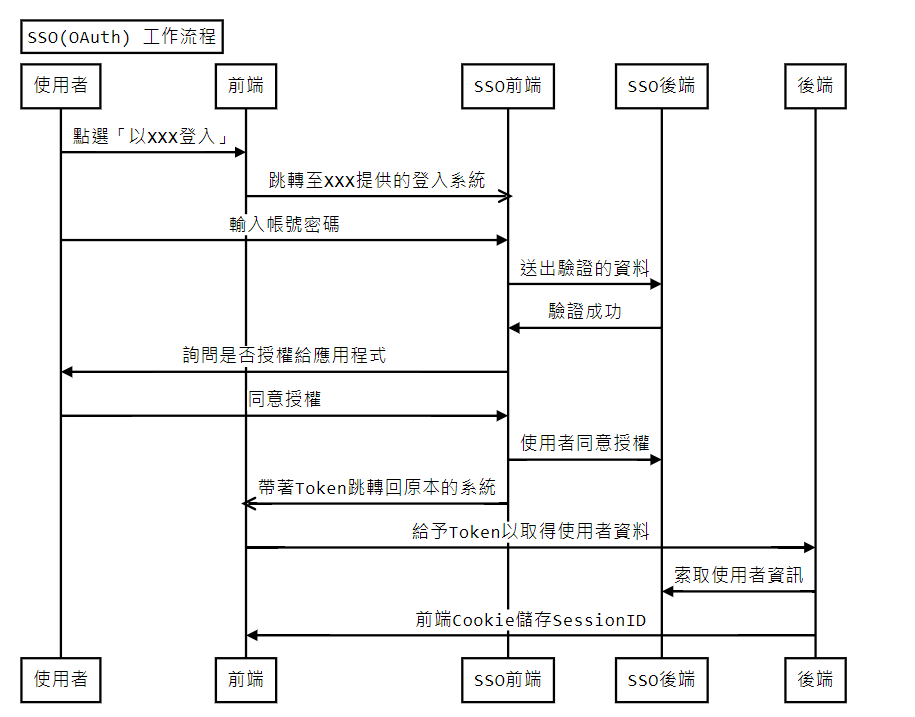

:::info 作者資料
[原始 MD by 祐民](https://hackmd.io/@ji03mmy18/Bk_sxp3Rj#/)
:::

# Authentication
### 登入驗證

*YoMin Su*

---

## 基礎環節

> 認識一下這是什麼東西

----

### 什麼是 Authentication？

----

在進行需要確認權限的請求時，身份識別、取得權限的過程，可以分成建立、驗證、銷毀三種階段。

----

### 為何需要 Authentication？

----

就如同前面提到的，在使用某些功能時，若不先驗證你是誰，你能做什麼，就可能導致你可以使用到不應該開放給你的功能，這在系統設計上是非常嚴重的問題。

----

### 目前有哪些可以實作的技術？

----

- Session
- Json Web Token
- AD / LDAP
- SSO(OAuth) (Authorization)

---

## Session

> 老歸老，但是好用

----

### How it works?

----

### 普通的細節

1. 當後端收到請求後，會去驗證使用者的有效性(查DB)
2. 比對相符後，就會將這筆資料儲存在後端的儲存區中(File, DB, RAM)
3. 並對應生成一組帶有時效限制的SessionID
4. 在回傳請求的回覆中，會加入一組Header，Key為Set-Cookie，Value則是SessionID
5. 在下一次的請求發生時，瀏覽器會自動帶入儲存的Cookie，進行驗證

----

### 細節的細節

1. 當請求送入後端後，若是需要驗證身份的路由，通常會將驗證功能放在中介層(Middleware)，若檢查未通過，會直接回傳錯誤資訊與4XX狀態碼
2. Set-Cookie Header 並非只存Key跟Value，還會連帶存入其他細節，如Expires, HttpOnly, Path, Secure, SameSite...等等設定

> [MDN Set-Cookie](https://developer.mozilla.org/en-US/docs/Web/HTTP/Headers/Set-Cookie)

----

### 實作的細節

每種程式語言的實作都有各自的方法，甚至，也可能因為使用的套件不同，而有不同的方案，這裡主要分享在JS/TS上開發Express後端時，常使用的 express-session 的作法，細節可參考連結文章

> [深入 Session 與 Cookie：Express、PHP 與 Rails 的實作
](https://blog.huli.tw/2019/08/09/session-and-cookie-part3/)

----

### 可能會遇到的問題

1. Cookie安全性 (CSRF)
2. 橫向擴展時，Session資料的同步

> [CSRF 攻擊原理](https://medium.com/@Tommmmm/csrf-%E6%94%BB%E6%93%8A%E5%8E%9F%E7%90%86-d0f2a51810ca)

---

## Json Web Token

> 驗證好方便

----

## How it works?

----

### 普通的細節

1. JWT可以分為三個部分，先透過Base64編碼再以「 . 」連接在一起，有各自的用途：
    - Header: 存放Token的種類跟Signature的雜湊算法
    - Payload: 存放要攜帶的資訊(用戶資料...等)
    - Signature: 前兩者的簽章，會加入自定義的密鑰，用於驗證資料是否有效

----

### 普通的細節II

2. 後端不負責儲存使用者的資料，這些東西都將放在Payload裡面
3. 前端接收到Token後需要自己儲存好，在下一次請求時帶著一起送出

> [[筆記] 透過 JWT 實作驗證機制](https://medium.com/%E9%BA%A5%E5%85%8B%E7%9A%84%E5%8D%8A%E8%B7%AF%E5%87%BA%E5%AE%B6%E7%AD%86%E8%A8%98/%E7%AD%86%E8%A8%98-%E9%80%8F%E9%81%8E-jwt-%E5%AF%A6%E4%BD%9C%E9%A9%97%E8%AD%89%E6%A9%9F%E5%88%B6-2e64d72594f8)

----

### 細節的細節

1. 當請求送入後端後，跟Session的處理會採用相似的方法，在Middleware中進行驗證，若Signature的部分與後端當下雜湊出來的結果不符，則回傳錯誤資訊與狀態碼
2. 正常的狀況下，JWT是個無法註銷的令牌，由於簽發後，必要的資訊都已傳送給前端，因此只要拿著這個令牌，在有效期限內送出請求，後端都需要回覆給前端正常的執行結果

----

### JavaScript 中的 JWT

在「jwt.io」中，有提供詳細的列表說明各種程式語言中，哪些套件是可以提供JWT功能的，除此之外，還有細節提及支援哪些算法與簽名。

> [JWT.io](https://jwt.io/libraries?language=JavaScript)

----

### 後端開發上的選擇

在後端開發上，多數人則選擇使用 [jsonwebtoken](https://www.npmjs.com/package/jsonwebtoken) 套件，其實作的部分就足夠開發者進行簽發與驗證了

當然，實際上也有 [express-jwt](https://www.npmjs.com/package/express-jwt) 可以使用，不過，這部分可以自己實際嘗試過後再做決定

----

### 可能會遇到的問題

1. 如何安全的儲存Token
2. 如何註銷尚未過期的Token

> [JSON Web Token(JWT) 儲存在前端那邊比較好?](https://www.kvzhuang.net/2019/04/json-web-tokenjwt.html)

---

## Session
## vs
## Json Web Token

----

[更好的選擇？用 JWT 取代 Session 的風險](https://blog.kenwsc.com/posts/2023/jwt-vs-session/)

---

## AD / LDAP

> 這個另一個大坑

----

### How it works?

----

### 為什麼這樣用？

因為當你有多個服務，且想要共用同一組帳號以方便使用者操作時，就會有這樣的需求出現！

----

### 可以選擇的套件

1. [ldap-authentication](https://www.npmjs.com/package/ldap-authentication)
2. [Passport.js](https://www.passportjs.org/)

若是只要基本的AD/LDAP驗證，透過上者就可以做到，但若也需要後續的管理(像是生成Session)，透過下者會更方便一點

----

### 可能會遇到的問題

通常驗證用的主機跟後端不會是同一台設備，在跨機器通訊時，有經過WAN，則會有AD/LDAP加密通訊相關的問題要處理，明碼總是危險的！

---

## SSO(OAuth)

> 以XXX登入，太多種了吧

----

### How it works?

----

### 為什麼寫著Authorization？

因為登入的步驟並非是在我們的系統執行的，是由其他系統進行，再將能索取所需資訊的Token傳給後端，這部分就屬於給予授權，而非驗證身份了

> [驗證(Authentication)與授權(Authorization)的區別](https://matthung0807.blogspot.com/2018/03/authenticationauthorization.html)

----

### 補充資訊：OAuth 2.0

> [[筆記] 認識 OAuth 2.0：一次了解各角色、各類型流程的差異](https://medium.com/%E9%BA%A5%E5%85%8B%E7%9A%84%E5%8D%8A%E8%B7%AF%E5%87%BA%E5%AE%B6%E7%AD%86%E8%A8%98/%E7%AD%86%E8%A8%98-%E8%AA%8D%E8%AD%98-oauth-2-0-%E4%B8%80%E6%AC%A1%E4%BA%86%E8%A7%A3%E5%90%84%E8%A7%92%E8%89%B2-%E5%90%84%E9%A1%9E%E5%9E%8B%E6%B5%81%E7%A8%8B%E7%9A%84%E5%B7%AE%E7%95%B0-c42da83a6015)