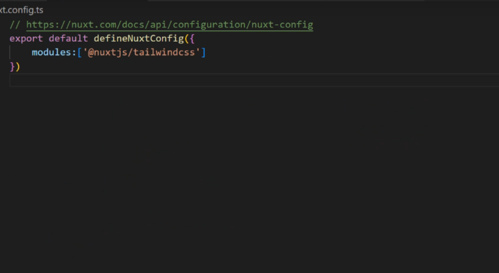
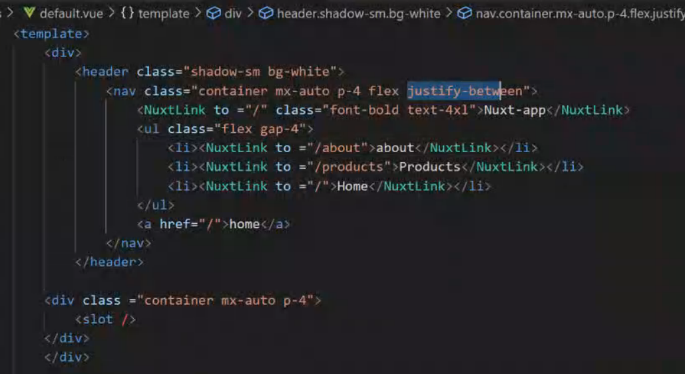

:::info 作者資料
[原始 MD by 育成](https://hackmd.io/@ss007711/r1fv0rvgn)
:::


:::tip 參考網站

[Nuxt3安裝](https://nuxt.com/docs/getting-started/installation)  
[CSS集成套件官方網站](https://tailwindcss.com/docs/installation)  
[CSS集成套件npm](https://www.npmjs.com/package/@nuxtjs/tailwindcss)  
:::

::::caution 依賴安裝
:::info 先安裝 nodejs
```bash showLineNumbers
curl -fsSL https://deb.nodesource.com/setup_18.x | sudo -E bash - &&\
sudo apt-get install -y nodejs
```
:::
:::info 安裝 Nuxt
```bash showLineNumbers
npx nuxi init <project-name> //去掉<>名字自己取
```
```bash showLineNumbers
npm install
npm run dev
```
:::

:::info 安裝 tailwindcss CSS

```bash 
npm install --save-dev @nuxtjs/tailwindcss
```
:::
::::

:::warning 參考檔案by 名琮
[**_需要的話點我下載_**](./static/2023-03-29/test.zip)
:::
---
---

# CSR vs SSR

----

## CSR
#### Client-Side Rendering
#### (客戶端渲染)

----


----

- 優點
    - 減少 Server 端的壓力
    - 頁面切換速度快
- 缺點
    - 首屏顯示慢
    - SEO不佳

----

## SSR
#### SR - Server-Side Rendering
#### (伺服器端渲染)

----


----

是網頁上面呈現的內容在伺服器端就已經生成好了，當用戶瀏覽網頁時，伺服器把這個在服務端生成好的完整的html結構內容響應給瀏覽器，而瀏覽器拿到這個完整的html結構內容後直接顯示(渲染)在頁面上的過程。

---

### 就是這樣
### 所以有了 Nuxt

----

### 沒錯正式進入我們的主題

----

### Nuxt3 

---

## 請先在你的Terminal 下
```bash showLineNumbers
node -v 
```

----


----

### node -v的版本要在16.10之上

如果沒有的話

----

[點此下載](
https://nodejs.org/zh-tw/download)
先把原本的版本砍掉再裝喔!

----

裝好後創個資料夾
再 cd 進去裡面

----


----

## 開始裝 nuxt3的專案

----

### 請注意一定要在你創的資料夾內下
```
npx nuxi init <project-name>
```


----

再cd進去你的專案


----

### 進去之後再下
 
 ```
 npm install
 ```
 ```
 npm run dev
 ```
 
 

---

把app.vue刪除掉後 新增一個pages的資料夾
裡面再新增兩個.vue的檔案


----

在index.vue輸入
```ts showLineNumbers
<template>
    <div>
        <h2>I am Home page</h2>
        <p>Today is my birthday,
            Today is not my birthday. </p>
        <p>Today is not my birthday,
            Today is my birthday.</p>    
    </div>
</template>
```

----

在about.vue輸入
```ts showLineNumbers
<template>
    <div>
        <h2>I am about page</h2>
        <p>You should give me a gift,
            you should not me give a gift. 
        </p>
        <p>You should not give me a gift,
            you should give me a gift.
        </p>    
    </div>
</template>
```

----

看一下你的網頁 在local3000的地方 預設是出現index.vue

----

如果你直接在網址後面多加 /about
就會出現about.vue的內容

----

那如果你不是打/about
而是 / products?

----

沒錯你會看到一個404的錯誤

---

在pages底下再新增一個資料夾
並建立兩個.vue的檔案


----

在products裡的index.vue內輸入
```ts showLineNumbers
<template>
    <div>
        <h2>I am Products</h2>
        <p>Choice an object as my birthday gift.</p>
        <p>Don't choice an object as my birthday gift.</p>
    </div>
</template>
```

----

在[id].vue中輸入
```ts showLineNumbers
<template>
    <div>
        <h2>Product for {{  }}</h2>
    </div>
</template>

<script setup>
    const {}= useRoute().params
</script>

```

----

請問const{ } 和 {{}}要填入甚麼
可以達到下圖的效果


> 答案是id
---

再專案內新增一個layouts的資料夾
並新增一個default.vue檔


----

再default.vue中輸入
```ts showLineNumbers
<template>
    <div>
        <header>
            <nav>
            <ul>
                <li><NuxtLink to ="/about">about</NuxtLink></li>
                <li><NuxtLink to ="/products">Products</NuxtLink></li>
                <li><NuxtLink to ="/">Home</NuxtLink></li>
            </ul>
        </nav>
        </header>
    
    <div>
        <slot />
    </div>
    </div>

</template>
```

----

之後再到在新增一個products的lyaouts
>意思是在layouts 資料夾 新增一個 products.vue 檔案

----

```ts showLineNumbers
<template>
    <div>
    <div>
        <slot />
    </div>
    <footer>
            <nav>
            <ul>
                <li><NuxtLink to ="/about">about</NuxtLink></li>
                <li><NuxtLink to ="/products">Products</NuxtLink></li>
                <li><NuxtLink to ="/">Home</NuxtLink></li>
            </ul>
        </nav>
    </footer>
    </div>

</template>
<style>
.router-link-active{
    color:red
}
li{
font-size: 25px;
}
</style>
```


----

最後再到[id].vue跟index.vue中輸入

----

```ts showLineNumbers
definePageMeta({
    layout :'products'
})
```


## CSS 部分

### import tailwindcss


### 修改頂部導航欄 CSS 實現代碼


