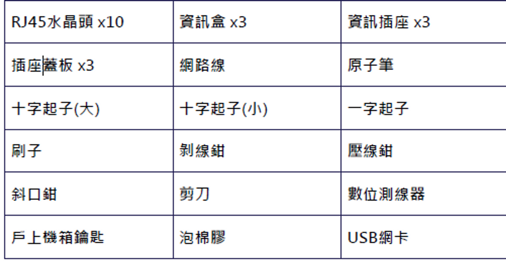

# 外修注意事項

外修要帶的東西

1. 工具箱
2. 棟機房鑰匙
3. 報修單、夾板、筆
4. 全通卡(務必保管好)

<aside>
💡 穿上網管背心，出發外修去~~~

</aside>

## 工具箱裡面有甚麼?

### 鉗子

- 斜口鉗
- 壓線鉗
- 剝線鉗
- 十字起子小
- 十字起子大
- 一字起子

### 網路消耗品

- 水晶頭10個
- 插座蓋板3個
- 資訊插座3個
- 資訊盒3個
- 網路線

### 檢測工具

- 外接網卡
- 數位測線器

### 雜項

- 原子筆
- 剪刀
- 刷子
- 泡棉膠
- 戶上機箱鑰匙

# 外修開始

## 外修開始!!!

1. 進入戶上，喊「網管小組網路維修」
2. 若有異性，後面加上「有男生/有女生」
3. 走到門前，確認使用者，再喊一次+敲門
4. 等開門
5. 開門後，詢問是否要脫鞋
6. 三次沒有回應，於報修單上勾一次未到

## 檢修順序

檢修順序

1. 檢查IP/DNS 設定
2. 檢查MAC
3. 測線
4. 電腦網路卡驅動
5. 換我們的外接網卡測試

### 外修可能遇到

### P1:使用者網路線斷掉

1. 請他重買一條

### P2:牆內斷線

1. 交換一條線芯，兩端重新壓製

### P3:MAC登錄錯誤

1. 請使用者重新設定過

外修可能會遇到…..

### P4:IP設定錯誤

1. 幫她修正

### P5:使用者想使用WIFI分享器

1. 測試網路線是否正常
2. 如果正常則請使用者自行設定(外籍生除外)

### P6:其他

1. 向跟你一起去的學長或學姊求救

### wifi 分享器設定 (非外籍生不協助處理)

1. 登入分享器管理介面(通常寫在分享器背面)
2. 抄寫WAN介面的MAC位置
3. 將WAN 的MAC 填寫至網管系統上
4. 設定WAN介面的IP位置